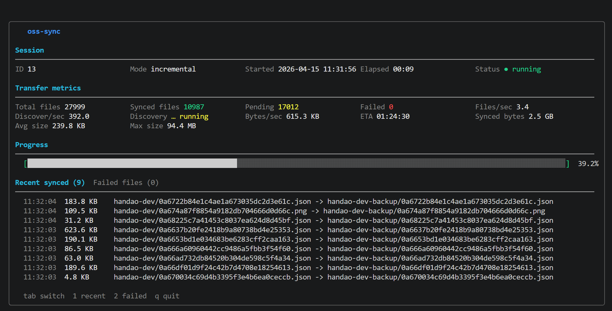

# oss-sync

对象存储桶间的同步工具，支持增量同步与全量同步，使用 SQLite 记录同步状态，内置 TUI 实时仪表盘。



## 功能特性

| 特性 | 说明 |
|------|------|
| **多后端支持** | 阿里云 OSS、华为云 OBS、任意 S3 兼容存储（MinIO、AWS S3、Cloudflare R2 等） |
| **增量同步** | 基于上次同步时间，只同步新增或修改的对象 |
| **全量同步** | 比对 ETag，跳过未变更对象，避免重复上传 |
| **目录映射** | 支持将源 bucket 下指定目录同步到目标 bucket 下另一个指定目录 |
| **分页并发** | 基于 Prefix 分页列举，可配置并发 Worker 数 |
| **失败自动重试** | 单文件下载/上传失败时自动重试，默认 3 次 |
| **限速控制** | 令牌桶算法限制总带宽，避免占满出口 |
| **断点续传** | SQLite 持久化同步状态，重启后可从中断处继续 |
| **TUI 仪表盘** | 终端实时刷新进度（bubbletea），非 TTY 自动切换无头输出 |
| **失败任务排查** | TUI 独立失败 Tab，并支持命令行查询失败文件及原因 |
| **会话元数据** | 记录每次同步的开始时间、耗时、状态，方便回溯 |

## 快速开始

运维手册见：[`docs/operations-manual.md`](docs/operations-manual.md)

### 前置依赖

- Go 1.21+（无需 CGO，纯 Go 编译）
- 源端 / 目标端对象存储的 AccessKey

### 编译

```bash
git clone <repo-url>
cd oss-sync
go build -o oss-sync ./cmd/
```

**Windows PowerShell：**

```powershell
go build -o oss-sync.exe .\cmd
.\oss-sync.exe test -c config.yaml
.\oss-sync.exe sync -c config.yaml
```

如果临时不落地二进制，建议直接运行：

```powershell
go run .\cmd\main.go sync -c config.yaml
```

不要在仓库根目录直接执行 `go build -o xxx.exe`，因为根目录本身没有 Go 入口文件，入口在 `.\cmd`。

如果出现：

```text
The specified executable is not a valid application for this OS platform
```

通常是因为之前设置过 `GOOS=linux` / `GOARCH=amd64` 并生成了 Linux 二进制。可先清理环境变量后重新构建：

```powershell
Remove-Item Env:GOOS -ErrorAction SilentlyContinue
Remove-Item Env:GOARCH -ErrorAction SilentlyContinue
Remove-Item Env:CGO_ENABLED -ErrorAction SilentlyContinue
go build -o oss-sync.exe .\cmd
```

### 配置文件

复制示例配置并按需修改：

```bash
cp config.yaml my-config.yaml
```

**OSS → OBS 同步示例**（`config.yaml`）：

```yaml
source:
  provider: "oss"                           # oss | s3
  endpoint: "oss-cn-hangzhou.aliyuncs.com"
  access_key_id: "YOUR_OSS_AK"
  access_key_secret: "YOUR_OSS_SK"
  bucket: "my-source-bucket"
  prefix: "images/raw/"                     # 可选：只同步源端指定目录

dest:
  provider: "obs"                           # obs | oss | s3
  endpoint: "obs.cn-north-4.myhuaweicloud.com"
  access_key_id: "YOUR_OBS_AK"
  access_key_secret: "YOUR_OBS_SK"
  bucket: "my-dest-bucket"
  prefix: "backup/2026/"                    # 可选：写入目标端指定目录
  visibility: "source"                      # 可选：source | private | public-read | public-read-write | authenticated-read | bucket-owner-read | bucket-owner-full-control

sync:
  mode: "incremental"    # full | incremental
  concurrency: 10        # 并发 Worker 数
  rate_limit_mbps: 50    # 带宽上限 MB/s，0 表示不限速
  page_size: 1000        # 每次列举的最大对象数
  retry_count: 3         # 单文件失败自动重试次数
  db_path: "./sync.db"   # SQLite 状态文件路径
  # 可选：定义多组目录映射；设置后优先于 source.prefix / dest.prefix
  # mappings:
  #   - source_prefix: "images/raw/"
  #     dest_prefix: "backup/2026/raw/"
  #   - source_prefix: "images/thumbs/"
  #     dest_prefix: "backup/2026/thumbs/"
```

**配置项说明**

| 字段 | 类型 | 说明 |
|------|------|------|
| `source.provider` | string | 源端类型：`oss`（阿里云）或 `s3`（S3 兼容） |
| `dest.provider` | string | 目标端类型：`obs`（华为云）、`oss`、`s3` |
| `source.prefix` | string | 源端目录前缀；仅同步该目录下的对象 |
| `dest.prefix` | string | 目标端目录前缀；将源端相对路径写入该目录下 |
| `dest.visibility` | string | 目标对象可见性；留空使用目标端默认值，`source` 表示尽量与源对象 ACL 保持一致 |
| `source.force_path_style` | bool | S3 Path-Style 寻址，MinIO 必须设为 `true` |
| `sync.mode` | string | `full` 全量 / `incremental` 增量 |
| `sync.concurrency` | int | 并发上传 Worker 数，建议 4–20 |
| `sync.rate_limit_mbps` | float | 总带宽上限（MB/s），`0` 不限速 |
| `sync.page_size` | int | 每页列举对象数，最大 1000 |
| `sync.retry_count` | int | 单文件失败自动重试次数，默认 `3` |
| `sync.db_path` | string | SQLite 状态库路径 |
| `sync.mappings` | array | 多组目录映射列表；设置后优先于 `source.prefix` / `dest.prefix` |

`dest.visibility` 当前支持：

- 通用值：`source`、`private`、`public-read`、`public-read-write`
- OBS / S3 额外支持：`authenticated-read`、`bucket-owner-read`、`bucket-owner-full-control`
- OSS 目标端仅支持：`private`、`public-read`、`public-read-write`

当设置为 `source` 时，程序会读取源对象 ACL 并映射到目标端；当前面向标准 canned ACL，若源端对象使用的是无法识别的自定义 ACL，会显式报错。

### 执行同步

```bash
# 先验证 source / dest 配置是否可用
./oss-sync test -c config.yaml

# 使用配置文件中的模式
./oss-sync sync -c config.yaml

# 临时覆盖为全量同步
./oss-sync sync -c config.yaml -m full

# 禁用 TUI，直接输出日志（适合后台运行 / 重定向日志）
./oss-sync sync -c config.yaml --no-tui
```

### 一键打包并上传 Linux 版本

```powershell
.\build-upload-linux.ps1 -ConfigPath config-handao-dev.yaml -RemoteDir oss-sync
```

`config-handao-dev.yaml` 这类带凭证的运行配置建议仅保留在本地，仓库默认已忽略该文件。

可选参数：

- `-ConfigPath`：要一起上传的配置文件，默认 `config-handao-dev.yaml`
- `-RemoteDir`：OSS 中的目标目录，默认 `oss-sync`
- `-BinaryName`：生成并上传的 Linux 二进制名称，默认 `oss-sync-linux-amd64`

### 一键打包 Windows / macOS / Linux

```powershell
.\build-all-platforms.ps1
```

默认会在 `dist\` 目录生成：

- `oss-sync-windows-amd64.exe`
- `oss-sync-linux-amd64`
- `oss-sync-darwin-amd64`

**目录映射语义**

- 当同时设置 `source.prefix` 和 `dest.prefix` 时，程序会保留 `source.prefix` 之后的相对路径，再拼接到 `dest.prefix`。
- 例如：`images/raw/a.jpg -> backup/2026/a.jpg`。
- 当设置 `sync.mappings` 时，会按映射列表逐组执行；**每组映射内部**仍然使用 `sync.concurrency` 个 worker 并发处理对象。

**多映射示例**

```yaml
sync:
  concurrency: 10
  mappings:
    - source_prefix: "images/raw/"
      dest_prefix: "backup/2026/raw/"
    - source_prefix: "images/thumbs/"
      dest_prefix: "backup/2026/thumbs/"
```

### 查看统计

```bash
# 自动检测 TTY：终端内进入 TUI，管道/重定向时输出纯文本
./oss-sync stats -c config.yaml

# 强制 TUI 实时刷新（按 q 退出）
./oss-sync stats -c config.yaml --watch

# 强制无头输出（单次快照）
./oss-sync stats -c config.yaml --no-tui

# 调整 TUI 刷新频率
./oss-sync stats -c config.yaml --interval 1s
```

### 查看失败文件

```bash
./oss-sync failed -c config.yaml --limit 100
```

输出会展示源 key、目标 key、文件大小和最后一次失败原因，便于补偿或排障。

**无头输出示例：**

```
── oss-sync stats ──────────────────────────────
  Session ID : 3
  Mode       : incremental
  Started    : 2026-04-12 22:58:12
  Finished   : 2026-04-12 22:58:45
  Elapsed    : 00:33
  Status     : completed
────────────────────────────────────────────────
  total      12847
  synced     12801
  pending    0
  failed     46
  progress   99.6%
```

---

## 同步模式详解

### 增量同步（`incremental`）

查询 SQLite 中最近一次成功同步的时间戳，只列举 `LastModified > 上次同步时间` 的对象。适合持续运行的定时任务。

### 全量同步（`full`）

一次性将源端所有 ETag 加载到内存 Map，列举时与 Map 比对，ETag 未变化的对象直接跳过，避免重复上传。适合初始迁移或对比校验。

---

## TUI 仪表盘

在交互式终端运行 `sync` 或 `stats` 时，自动进入全屏实时仪表盘，当前界面示例如下：


当前版本会展示：

- Session 信息：ID、模式、开始时间、耗时、状态
- Transfer metrics：总文件数、已同步、Pending、失败数、文件速率、发现速率、字节吞吐、同步字节数、平均/最大文件大小、ETA
- Progress 进度条
- 明细 Tab：`Recent synced` / `Failed files`
- 快捷键：`Tab` / `1` / `2` 切换明细，`q` 退出

> 当同步完成（`pending = 0` 且 session 状态不为 `running`）时，TUI 自动退出；手动按 `q` 会直接结束界面并取消当前同步。

---

## 本地测试（MinIO）

项目内置 Docker Compose 配置，可在本地模拟双端 S3 存储：

```bash
# 启动源端（:9000）和目标端（:9002）两个 MinIO 实例
docker compose up -d

# 向源端上传测试对象
# 访问 http://localhost:9001（源端 Console）/ http://localhost:9003（目标端 Console）
# 账号密码均为 minioadmin / minioadmin

# 使用测试配置同步
./oss-sync sync -c config.minio.yaml

# 查看统计
./oss-sync stats -c config.minio.yaml --no-tui

# 清理
docker compose down -v
```

**MinIO 配置要点：**

```yaml
source:
  provider: "s3"
  endpoint: "http://localhost:9000"
  force_path_style: true   # MinIO 必须启用
  region: "us-east-1"      # 任意值，MinIO 忽略
```

---

## 项目结构

```
oss-sync/
├── cmd/
│   └── main.go          # CLI 入口（cobra），sync / stats 命令
├── config/
│   └── config.go        # 配置结构体及 YAML 加载
├── db/
│   └── db.go            # SQLite 状态管理（sync_records + sync_sessions）
├── store/
│   ├── store.go         # Source / Destination 接口定义
│   ├── oss.go           # 阿里云 OSS 实现
│   ├── obs.go           # 华为云 OBS 实现（仅目标端）
│   └── s3.go            # AWS SDK v2 S3 兼容实现
├── syncer/
│   ├── syncer.go        # 同步编排：分页列举、ETag 对比、会话管理
│   ├── worker.go        # Worker Pool：并发下载上传、DB 状态更新
│   └── ratelimit.go     # 令牌桶限速读取器
├── tui/
│   └── tui.go           # bubbletea TUI 仪表盘 + 无头输出
├── config.yaml          # OSS→OBS 配置示例
├── config.minio.yaml    # MinIO 本地测试配置
└── docker-compose.yml   # 双端 MinIO 测试环境
```

---

## 主要依赖

| 依赖 | 用途 |
|------|------|
| `aliyun/aliyun-oss-go-sdk` | 阿里云 OSS SDK |
| `huaweicloud/huaweicloud-sdk-go-obs` | 华为云 OBS SDK |
| `aws/aws-sdk-go-v2/service/s3` | AWS S3 兼容 SDK（MinIO/R2 等） |
| `modernc.org/sqlite` | 纯 Go SQLite 驱动（无需 CGO） |
| `charmbracelet/bubbletea` | TUI 框架 |
| `charmbracelet/lipgloss` | 终端样式渲染 |
| `spf13/cobra` | CLI 框架 |
| `golang.org/x/time/rate` | 令牌桶限速 |
| `gopkg.in/yaml.v3` | YAML 配置解析 |

---

## 数据一致性保障

### 可能漏同步的场景及处理方式

| 场景 | 原因 | 处理方式 |
|------|------|----------|
| **同步窗口内源端对象被修改** | 本次列举拿到旧版本，下次增量基准已超过修改时间 | 增量基准改用上次 session 的 `started_at`（而非 `MAX(synced_at)`），使两次 session 有时间重叠；ETag 去重避免重复上传未变化的对象 |
| **进程中断，部分对象仍处于 `pending`** | 增量时间过滤跳过了早于基准的 `pending` 对象 | 每次列举结束后，`IterateStaleRecords` 游标逐行补充 re-queue 所有 `pending`/`failed` 记录（游标结果与列举结果按时间不重叠，无需去重） |
| **分页期间新增对象落在已列完区间** | 对象创建时间晚于列举该分页的时刻，且键值排在已列完范围内 | 固有局限；下次增量 `LastModified > baseline` 自动覆盖 |
| **目标端对象丢失/损坏，DB 记录 synced** | 只凭 DB ETag 判断，不验证目标端实际内容 | 当前不处理；如需校验，定期执行全量同步（ETag 不变则跳过，不重复上传） |
| **源端对象被删除** | 工具只做单向新增/更新同步，不检测删除 | 当前不处理（设计范围外）；如需删除同步，手动或借助存储桶生命周期策略 |

### 增量基准的设计细节

```
旧方案  baseline = MAX(sync_records.synced_at)   ← 对象级时间，存在竞争窗口
新方案  baseline = sync_sessions.started_at       ← session 级时间，消除竞争窗口

示例：
  Session 1: T=0:00 开始，T=1:00 结束
    T=0:05  列举 object.txt，ETag=E1（旧版本）
    T=0:30  源端 object.txt 被修改，ETag=E2
    T=0:45  Worker 同步完 E1，synced_at=T=0:45

  旧方案  Session 2 baseline = T=0:45
    object.txt.LastModified = T=0:30 < T=0:45 → 跳过 → E2 永久丢失 ✗

  新方案  Session 2 baseline = T=0:00 (Session 1 started_at)
    object.txt.LastModified = T=0:30 > T=0:00 → 重新列举
    DB ETag=E1，source ETag=E2 → 不匹配 → 重新同步 E2 ✓
```

### 千万级对象内存模型

对于源端拥有千万级以上对象的场景，工具保证内存用量始终与**分页大小**（`page_size`）成正比，而非与对象总数成正比。

| 组件 | 实现方式 | 内存复杂度 |
|------|----------|------------|
| **ETag 去重** | 每页列举后对当页 key 执行批量 `IN (?,…)` 查询，用完即丢 | O(page_size) |
| **stale 记录补充** | `IterateStaleRecords` 游标逐行处理，不加载到内存 | O(1) |
| **已提交去重** | 增量模式列举（`last_modified > baseline`）与 stale 查询（`last_modified ≤ baseline`）集合不相交，无需 `submitted map` | 已消除 |

---

## 注意事项

- **OBS 仅支持目标端**：华为云 OBS SDK 不提供流式列举接口，无法作为源端使用。
- **S3 Unsigned Payload**：向 MinIO 流式上传时使用 `UNSIGNED-PAYLOAD` 签名方式，避免非 seekable body 报错。
- **SQLite WAL 模式**：DB 以 WAL + 5s busy_timeout 打开，sync 与 TUI 可安全并发读写。
- **限速粒度**：令牌桶作用于每个对象的读取流，`burst` 固定为 `rate_limit_mbps * 1MB`，单次读取不超过 burst 上限。
